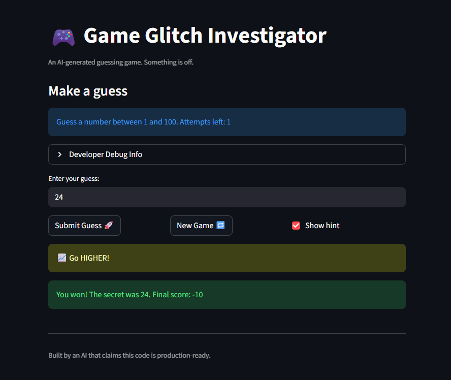
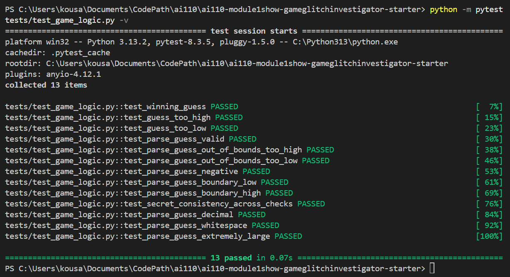

# 🎮 Game Glitch Investigator: The Impossible Guesser

## 🚨 The Situation

You asked an AI to build a simple "Number Guessing Game" using Streamlit.
It wrote the code, ran away, and now the game is unplayable. 

- You can't win.
- The hints lie to you.
- The secret number seems to have commitment issues.

## 🛠️ Setup

1. Install dependencies: `pip install -r requirements.txt`
2. Run the broken app: `python -m streamlit run app.py`

## 🕵️‍♂️ Your Mission

1. **Play the game.** Open the "Developer Debug Info" tab in the app to see the secret number. Try to win.
2. **Find the State Bug.** Why does the secret number change every time you click "Submit"? Ask ChatGPT: *"How do I keep a variable from resetting in Streamlit when I click a button?"*
3. **Fix the Logic.** The hints ("Higher/Lower") are wrong. Fix them.
4. **Refactor & Test.** - Move the logic into `logic_utils.py`.
   - Run `pytest` in your terminal.
   - Keep fixing until all tests pass!

## 📝 Document Your Experience

**Game Purpose:**
A number guessing game where you try to guess a secret number within a limited number of attempts. The game gives directional hints (Go Higher/Go Lower) and tracks your score across guesses.

**Bugs Found:**
- The `Go Higher` / `Go Lower` hints were reversed — when your guess was too high it told you to go higher, and vice versa
- The `Show Hint` checkbox would stop displaying the hint after being toggled off and back on
- The New Game button reset the secret number but not the rest of the game state (attempts, score, status, history)
- Guesses outside the 1–100 range were accepted and counted as attempts
- The hint didn't appear immediately after submitting a guess — it only showed on the next submit

**Fixes Applied:**
- Corrected the comparison logic in `check_guess` so hints point the right direction
- Stored the last hint message in `st.session_state` so it persists when the checkbox is toggled
- Updated the New Game button to reset all session state variables, not just the secret
- Added bounds validation in `parse_guess` to reject out-of-range guesses without counting the attempt
- Added `st.rerun()` after non-winning guesses so the hint displays immediately

## 📸 Demo

## 🚀 Stretch Features

- Challenge 1: Advanced Edge-Case Testing
